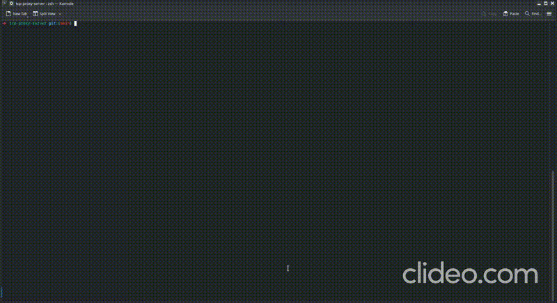

# TCP Proxy Server for SQL Logging

## Overview

This project implements a multithreaded TCP proxy server in C++ that logs all SQL queries passing through it.
The proxy server acts as an intermediary between a client and a SQLite database.
It captures and logs SQL queries in real-time and returns the results to the client.

## Features

- Handles multiple client connections simultaneously using multithreading.
- Logs all SQL queries to a file with timestamps.
- Supports SQL operations on a SQLite database.

## Requirements

- **C++17 or later**
- **CMake**
- **SQLite3**
- **Pthread** (for multithreading)
- **g++/clang++** (for compilation)

## Usage

### 1. Build the Project

```bash
make rebuild
```

### 2. Run the Proxy Server

```bash
make run-server
```

### 3. Run the Client


```bash
make run-client-manual
```

You can run multiple instances of the client

### 4. Test SQL Queries

Use the client program to send SQL queries to the server. 

The queries will be logged in the `sql_queries.log` file with their respective timestamps.

### Example SQL Queries

- Create a table:
  ```sql
  CREATE TABLE IF NOT EXISTS users(id INTEGER PRIMARY KEY AUTOINCREMENT,name TEXT NOT NULL,age INTEGER NOT NULL);
  ```
- Insert data:
  ```sql
  INSERT INTO users (name, age) VALUES ('Oliver', 25);
  ```
- Select data:
  ```sql
  SELECT * FROM users;
  ```
- Check SQLite version:
  ```sql
  SELECT sqlite_version();
  ```

### 5. Logging

All SQL queries executed through the proxy server are logged in `sql_queries.log` with timestamps.

Error queries will not be logged.

## Demonstration


